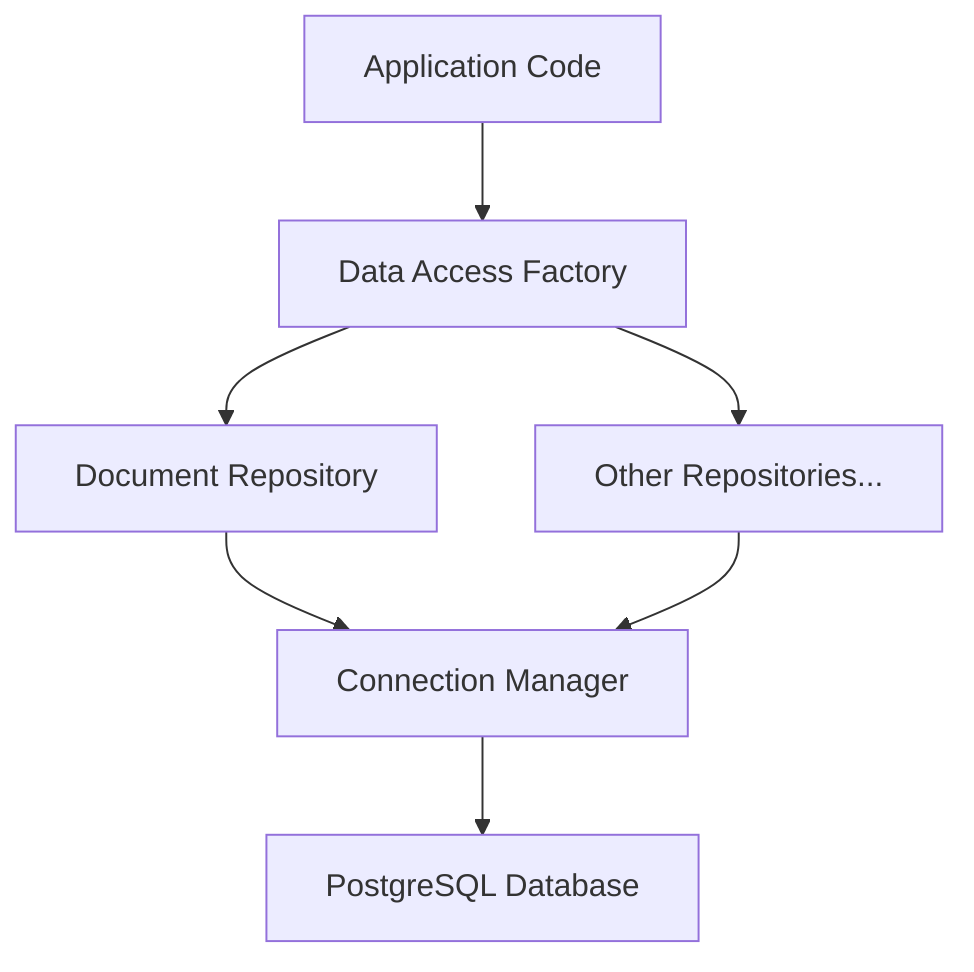

# PostgreSQL Data Access Layer Documentation

## Overview
This data access layer provides a robust interface for interacting with PostgreSQL in the document management system. It implements the repository pattern with TypeORM, offering type-safe database operations, connection pooling, and comprehensive error handling.

## Architecture



## Key Components

### 1. Interfaces
- `IRepository<T>`: Base repository interface for CRUD operations
- `IDocumentRepository`: Document-specific repository with specialized operations

### 2. Implementation Classes
- `PostgresDocumentRepository`: Main implementation for document operations
- `PostgresConnectionManager`: Handles database connections and pooling
- `DataAccessFactory`: Creates and manages repository instances

### 3. Configuration
- `PostgresConfig`: Configuration management for database connections

## Usage Examples

### Basic Setup
```typescript
// Initialize connection manager
const connectionConfig = {
  host: 'localhost',
  port: 5432,
  database: 'docmanager',
  username: 'app_user',
  password: 'secure_password'
};

const connectionManager = PostgresConnectionManager.getInstance(connectionConfig);
const dataAccess = DataAccessFactory.getInstance(connectionManager);

// Get document repository
const documentRepo = await dataAccess.getDocumentRepository();
```

### Common Operations

#### Finding Documents
```typescript
// Find by ID
const document = await documentRepo.findById(123);

// Find by organization with options
const orgDocs = await documentRepo.findByOrganization(orgId, {
  limit: 20,
  offset: 0,
  includeSummaries: true,
  orderBy: { createdAt: 'DESC' }
});

// Find related documents
const relatedDocs = await documentRepo.findRelatedDocuments(documentId, 2);
```

#### Creating Documents
```typescript
// Create document with summary
const newDoc = await documentRepo.createWithSummary({
  title: 'New Document',
  content: 'Document content...',
  ownerId: userId,
  orgId: organizationId,
  documentType: 'article',
  status: 'draft'
}, {
  content: 'Document summary...',
  summaryType: 'abstract',
  toolAgent: 'summarizer-v1'
});
```

#### Updating Documents
```typescript
// Update with version tracking
const updatedDoc = await documentRepo.updateWithVersion(
  documentId,
  {
    title: 'Updated Title',
    content: 'Updated content...'
  },
  'Updated document title and content'
);
```

## Performance Considerations

### Connection Pooling
- Default pool size: 2-20 connections
- Suitable for dozens of concurrent users
- Configurable idle timeout: 30 seconds
- Connection acquisition timeout: 5 seconds

### Query Optimization
- Automatic query logging for operations exceeding 1 second
- Metrics tracking for monitoring performance
- Built-in connection pooling for efficient resource usage

### Caching
- Query result caching enabled (1-minute duration)
- Database-backed cache for consistency

## Security Features

### Query Safety
- Parameterized queries for SQL injection prevention
- Prepared statements for repeated operations
- Transaction support for data integrity

### Access Control
- Organization-level data isolation
- User ownership validation
- Role-based access control integration

## Error Handling

### Repository Layer
- Structured error handling with specific error types
- Transaction rollback on failures
- Detailed error logging
- Retry logic for transient failures

### Connection Management
- Automatic connection recovery
- Connection pool monitoring
- Health checks and diagnostics

## Monitoring and Metrics

### Available Metrics
- Operation counts
- Error rates
- Slow query detection
- Connection pool status

### Usage Example
```typescript
// Get metrics for document repository
const metrics = dataAccess.getMetrics('document');
console.log('Total operations:', metrics.operationCount);
console.log('Error count:', metrics.errorCount);
console.log('Slow queries:', metrics.slowQueryCount);
```

## Best Practices

1. **Connection Management**
   - Always use the connection manager instead of creating direct connections
   - Close connections properly when shutting down the application
   - Monitor connection pool metrics

2. **Transaction Handling**
   - Use transactions for operations that modify multiple records
   - Keep transactions short and focused
   - Handle rollbacks properly

3. **Error Handling**
   - Always catch and handle database errors appropriately
   - Log errors with sufficient context
   - Use type-safe error handling

4. **Query Optimization**
   - Monitor slow queries
   - Use appropriate indexes
   - Limit result sets with pagination

## Implementation Notes

- The data access layer is designed for a document management system with B2B multi-tenant requirements
- Performance is optimized for standard web response times (< 1 second)
- The implementation supports low concurrent user loads (dozens of users)
- The design focuses on maintainability and type safety
